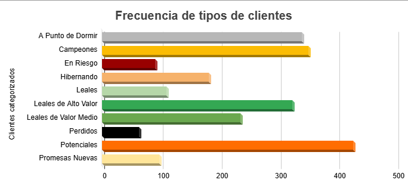
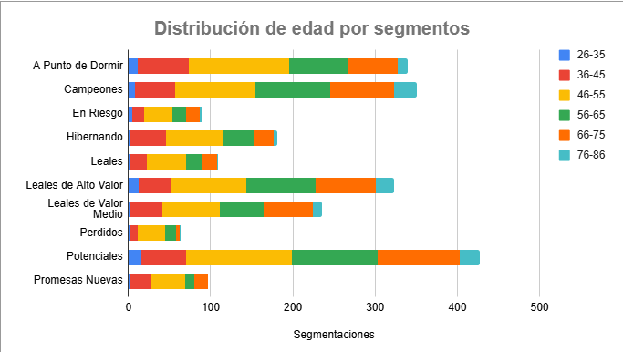
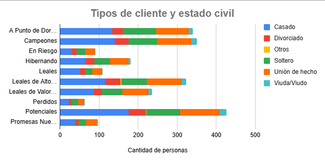
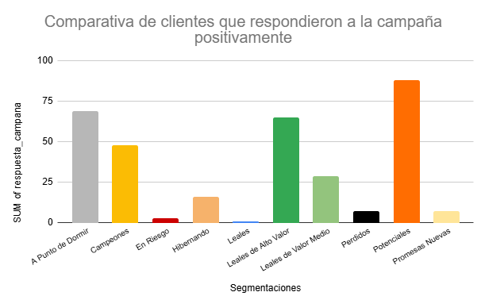
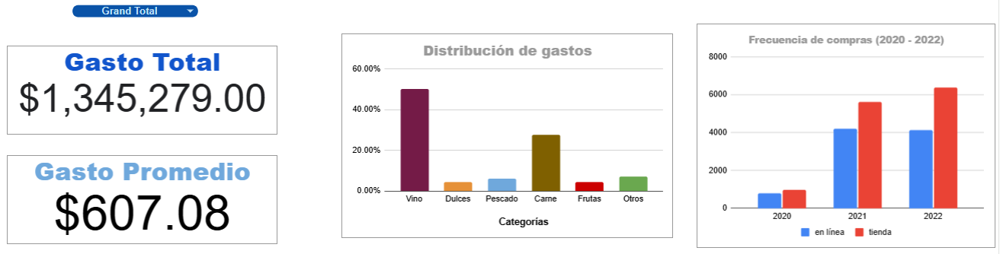
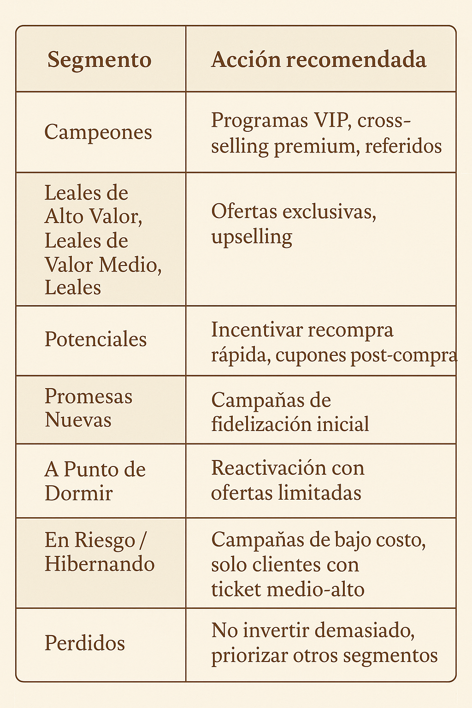

# Proyecto 1

## Procesar y preparar base de datos

## **Hoja 1: clientes**

- Revisar tipos de datos en columnas
- Identificar datos faltantes con:

```
=SI(CONTARA(A2:I2)<COLUMNAS(A2:I2), "FALTANTE", "OK")
```

- Validez en años de nacimiento con:

```
=SI(O(NO(ESNUMERO(B2)), B2<1920, B2>2005), "Error", "OK")
```

- Validez en ingreso anual dólares:

```
=SI(O(NO(ESNUMERO(E2)), E2<0, E2>1000000), "Error", "OK")
```

- Validez en fecha de entrada con:

```
=SI(Y(ESNUMERO(H3),H3<=HOY()), "OK", "Error")
```

- Identificar duplicados considerando el _id_cliente_:

```
=SI(CONTAR.SI($A$2:$A$2217, A2)>1, "Duplicado", "Ok")
```

- Identificar blancos, por cada renglón usé:

```
=CONTAR.BLANCO(A2:I2)
```

Y al final contabilizé cuántos habían dado "1" porque esos tenían algún dato faltante. Los cuales me dieron 24 renglones con valor faltante en la columna de _ingreso_anual_dolar_

Siendo estos registros:

1295, 1612, 1994, 2437, 2863, 2902, 3117, 3769, 4345, 5079, 5250, 5255, 5798, 7187, 7244, 7281, 8268, 8557, 8720, 8996, 9235, 10339, 10475, 10629

Decidí eliminarlos ya que representaban una proporción del 1% de mis datos y me interesa tener datos completos.

## **Hoja 2: resumen_compras**

Para esta tabla se identificaron Blancos con:

```
=CONTAR.BLANCO(A2:G2)
```

No hubo valores en blanco.

Posteriormente se verificaron valores duplicados con:

```
=CONTAR.SI(A:A, A2)
```

Se aplicó esa fórmula para las filas siguiente y se detectó que 9 filas estaban duplicadas, se revisaron cuáles eran y se eliminaron los duplicados, siendo estos registros (_id_cliente_) los duplicados:

```
1646, 2656, 2666, 4418, 5721, 7990, 8207, 9723, 10652
```

Nos quedamos con un registro para cada _id_cliente_

## **Hoja 3: transacciones**

Para la tabla de transacciones nuevamente se utilizó:

```
=CONTAR.BLANCO(A2:D2)
```

Para identificar valores en blanco para cada fila.
Se descubrió que 7 renglones tenían valor en blanco para la columna de _id_cliente_. Esos registros se decidieron eliminar porque nuevamente representaban una proporción muy baja respecto al resto de los datos, pero también el no poder asignar los datos a un cliente en particular nos generaba un sezgo para continuar con ellos.

Los datos eliminados con _id_cliente_ faltante fueron aquellos con estos id_transacciones:

```
805088942, 410352875, 788057945, 601858527, 345606837, 179794745, 531229465
```

Dado que en esta tabla se tenían varios registros de transacciones para el mismo id_cliente, se optó por agrupar la cantidad de transacciones realizadas por un cliente (id_cliente) y determinar la fecha de su última compra con:

```
=QUERY(transacciones!A:D, "SELECT B, MAX(C), COUNT(A) WHERE B IS NOT NULL GROUP BY B")
```

# Unión de tablas

Se hizo una copia de la tabla **clientes**, de esa copia se ocupó VLOOKUP desde la columna J hasta la columna O, pasando los datos de la tabla **resumen_compras** a partir del id_cliente

```
=BUSCARV(A2, resumen_compras!A:G,2,FALSO)
```

De igual manera para pasar datos de la tabla **transacciones**, se usó BUSCARV para las columnas P (fecha de último pedido), Q(número de transacciones)

```
=BUSCARV(A2, transacciones!G:I,2,FALSO)
```

Finalmente en otra columna se calculó la edad de las personas con la fórmula:

```
=AÑO(HOY())-B2
```

En la celda B2 se encontraba el año de nacimiento de los clientes. Se identificaron 3 registros con edades superiores a 100 años. Dado que los datos de montos son relevantes, se optó por imputar esos valores con la mediana de las edades, calculada excluyendo dichos registros. El valor de la mediana resultante fue de 55 años.

```
Calculo mediana:
=MEDIANA(SI('Unión Tablas'!R2:R < 100, 'Unión Tablas'!R2:R))
```

| ID    | Valor antes | Valor imputado |
| :---- | :---------- | :------------- |
| 1150  | 126         | 55             |
| 7829  | 125         | 55             |
| 11004 | 132         | 55             |

## Variables categóricas

Son aquellas que no tienen valores numéricos, se usan gráficos de barras, y gráficos circulares para conocer la distribución de los datos.

## Variables numéricas

Se usan histogramas para visualizar variables numéricas. Un histograma te muestra de forma visual:

- La frecuencia: Te dice cuántos clientes caen dentro de un rango específico de valores.

- La forma de la distribución: Te ayuda a ver si los datos están concentrados en un rango específico, si hay valores atípicos (outliers), o si la distribución es sesgada.

Aquí el análisis descriptivo de variables numéricas:

| Column 1                | Media       | Mediana | Desv. Estándar | Mínimo | Máximo | Percentiles (25) | Percentiles (50) | Percentiles (75) |
| ----------------------- | ----------- | ------- | -------------- | ------ | ------ | ---------------- | ---------------- | ---------------- |
| ingreso_anual_dolar     | 52247.25135 | 51381.5 | 25173.07666    | 1730   | 666666 | 35303            | 51381.5          | 68522            |
| monto_vino              | 305.0916065 | 174.5   | 337.3279201    | 0      | 1493   | 24               | 174.5            | 505              |
| monto_frutas            | 26.35604693 | 8       | 39.79391652    | 0      | 199    | 2                | 8                | 33               |
| monto_carnes            | 166.9959386 | 68      | 224.2832728    | 0      | 1725   | 16               | 68               | 232.25           |
| monto_pescados          | 37.63763538 | 12      | 54.75208241    | 0      | 259    | 3                | 12               | 50               |
| monto_dulces            | 27.02888087 | 8       | 41.07204567    | 0      | 262    | 1                | 8                | 33               |
| monto_otros             | 43.96525271 | 24.5    | 51.81541437    | 0      | 321    | 9                | 24.5             | 56               |
| edad                    | 56.08122744 | 55      | 11.69235785    | 29     | 85     | 48               | 55               | 66               |
| Número de transacciones | 9.890794224 | 10      | 5.214910564    | 1      | 27     | 5                | 10               | 14               |
| Gasto_total             | 607.075361  | 396.5   | 602.9004764    | 5      | 2525   | 69               | 396.5            | 1048             |
| Recencia                | 169.6272563 | 134.00  | 147.6415067    | 0.00   | 879.00 | 54               | 134              | 245              |

## Cálculo de cuartiles

Para calcular RFM se necesitan los datos de recencia, hay algunas transacciones que no tienen valor registrado de última compra ni un valor en conteo de transacciones, para el caso de la recencia se tomo la fecha_entrada y para el conteo de transacciones se imputará con el valor de 1, ya que sí tienen montos registrados.

Los id's que fueron imputados para el caso de fecha de última compra y de frecuencia de transacciones fueron:

3955, 4931, 5376, 5555, 6862, 8475, 9931, 10749, 11110,11181

La Recencia debe ser el número de días que han pasado desde la última compra del cliente hasta el último día de tu base de datos, por lo que se calculó la última fecha de la tabla de transacciones con:

```
=MAX(H2:H2231)
```

Dando como resultado 12/31/2022, fecha que se utilizó para calcular recencia.

Al tener una comprensión visual de los datos, es momento de usar los cuartiles para segmentar a los clientes de manera precisa y numérica.

Esto, para dividir a los clientes en grupos para cada una de las tres métricas RFM: Recencia, Frecuencia y Valor Monetario.

La segmentación RFM es como un juego de clasificar clientes usando tres cosas:

Recency (Recencia) → ¿Hace cuánto vino por última vez?

Frequency (Frecuencia) → ¿Cuántas veces ha venido?

Monetary (Monetario) → ¿Cuánto dinero gasta?

Considerando los cuartiles asigné valores del 1 al 4 para cada métrica del RFM.

Puntaje de Recencia: Se ocupo un condicional IFS para determinar si el valor de recencia obtenido era mayor o igual a qué cuartil, comparando y asignando valores progresivamente.

El cálculo para los puntajes de Frecuencia y Valor monetario fue el mismo.

Ejemplo:

```
=IFS(T2 <= 'Análisis Descriptivo'!$G$12, 4, T2 <= 'Análisis Descriptivo'!$H$12, 3, T2 <= 'Análisis Descriptivo'!$I$12, 2, VERDADERO, 1)
```

## Segmentaciones

Se obtuvo un valor de 1 a 4 para cada parámetro de Recencia, Frecuencia y Valor Monetario. Considerando que mientras menos tiempo pasó entre la última compra, se ponderó con 4, a mayor frecuencia 4 y mayor gasto también con 4. De manera que los mejores clientes tendrían una combinación RFM de 444.
De ahí se clasificaron considerando las diferentes combinaciones, entendiend que un cliente 111 compró hace mucho, con poca frecuencia y bajo valor monetario.

A partir de esta combinación definí los siguientes grupos de clientes:

```
Campeones → Compran muy recientemente, con alta frecuencia y buen gasto.

Leales de Alto Valor → Clientes frecuentes y de alto gasto, aunque no tan recientes como los campeones.

Leales de Valor Medio → Compran seguido, con gasto medio.

Leales → Clientes fieles pero con gasto más bajo.

Potenciales → Compradores que muestran interés, pero aún no son totalmente leales.

Promesas Nuevas → Clientes recientes que comienzan a comprar.

A Punto de Dormir → Clientes con compras pasadas pero que se están alejando.

En Riesgo → Clientes con poca frecuencia reciente.

Hibernando → Clientes muy inactivos y con bajo gasto.

Perdidos → Clientes que prácticamente ya no compran.
```

## Gráficos







## Hallazgos y recomendaciones estratégicas por segmento de compra.



```
🥂 Vinos = categoría más rentable → reforzar en Campeones y Leales.


🥩 Carne / Otros = segundo nivel de gasto → cross-selling con Potenciales.


🐟🍬 Pescado y dulces = bajo gasto → productos de entrada para atraer a clientes en riesgo.


🏪 Mayor compra en tienda física → potenciar promociones y experiencia en punto de venta.


🌐 Bajo canal online → oportunidad de crecimiento digital con campañas segmentadas.

```
